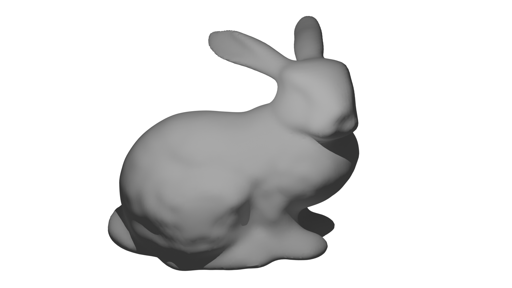

# 3D Poisson Surface Reconstruction

  

## Overview
This repository contains the implementation of the Poisson Surface Reconstruction paper (https://hhoppe.com/poissonrecon.pdf). The implementation leverages Python and PyTorch to construct a 3D mesh from a cloud of points.
For more informations please refer to IG3DA_RIFFAUD.pdf

## Features
- Efficient handling of matrix and array operations using PyTorch.
- Visualization support with Matplotlib.
- Utilizes an octree for organizing point cloud data.
- Solves linear systems crucial for generating the mesh.
- Extracts iso-surfaces to finalize the 3D mesh construction.

## Reference

Kazhdan, Michael, Matthew Bolitho, and Hugues Hoppe. "Poisson surface reconstruction." Proceedings of the fourth Eurographics symposium on Geometry processing. Vol. 7. No. 4. 2006.
